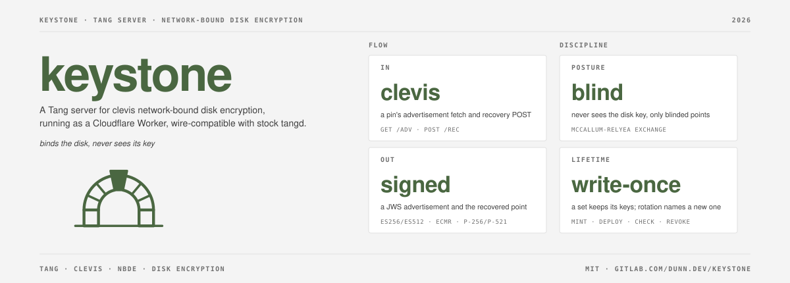

# keystone

keystone is a Tang server for clevis network-bound disk encryption. It runs as a Cloudflare Worker, speaks the protocol of stock `tangd` and serves any number of named key sets from one deployment. A bound disk unlocks at boot by reaching the Worker over HTTPS. Deleting a set's secret revokes it. `keyset` mints, checks, deploys and revokes the sets.

Shared as-is: no roadmap, no support promise. Report security problems as [SECURITY.md](SECURITY.md) describes.

A `tangd` on your LAN suits hosts that can reach one. keystone is for hosts that cannot.

## Security model

An internet-facing Tang server unlocks a stolen disk from anywhere it can be reached. Revocation is the control.

- `rec` answers any client, as in `tangd`. `adv` is public by design and carries only public keys.
- A revoked set answers 404, and its disks stop unlocking from then on. A host that already unlocked keeps its disk key.
- Private keys live in Worker secrets, which the API cannot read back once written. Any Worker version the account deploys can read them, so whoever controls the Cloudflare account controls the keys. Protect it like the disks.
- Worker versions carry their secrets. A rollback past a revoke serves the revoked set again, and `wrangler secret list` does not show it. Never roll back across a revoke. A tombstone in the deploy input makes `keyset deploy` detect and drop it.
- On the Free plan every request counts toward the daily Workers quota. A flood can exhaust it, and bound hosts fall back to their passphrase until it resets. A WAF rate limit mitigates.
- The unlock alert is a tripwire, not an audit log. Workers Logs records every successful `rec`.
- To split trust, bind with `clevis sss` across keystone and a second server.

## Setup

[docs/setup.md](docs/setup.md) covers install, Cloudflare setup, a first bound disk, rotation, revocation, alerts and the route and key set reference.

## Contributing

See [CONTRIBUTING.md](CONTRIBUTING.md). Issues and merge requests live on GitLab; the GitHub copy is a mirror.
